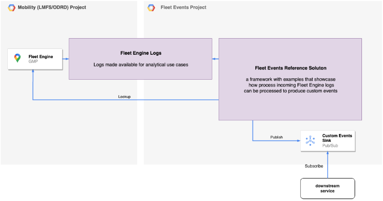

## **Documents Index**

* [Fleet Events Reference Solution](./README.md) (landing page)
    * [Getting started - Dataflow ](./beam/README.md)(set up Fleet Events with the Dataflow processor)
    * [Getting started - Cloud Functions](./cloud-functions/README.md) (set up Fleet Events with the Cloud Functions processor)
        * [ODRD Overview](./cloud-functions/src/main/java/com/google/fleetevents/odrd/README.md) (describes components of the Cloud Functions processor)
            * [ODRD handlers](./cloud-functions/src/main/java/com/google/fleetevents/odrd/handlers/README.md) (describes each handler supported by ODRD solution)
            * [Transactions](./cloud-functions/src/main/java/com/google/fleetevents/odrd/transactions/README.md) (describes Firestore transactions)
        * [LMFS Overview](./cloud-functions/src/main/java/com/google/fleetevents/lmfs/README.md) (describes components of the Cloud Functions processor)
            * [LMFS handlers](./cloud-functions/src/main/java/com/google/fleetevents/lmfs/handlers/README.md) (describes each handler supported by LMFS solution)
            * [Transactions](./cloud-functions/src/main/java/com/google/fleetevents/lmfs/transactions/README.md) (describes Firestore transactions)

## **Repo Structure**

This git repo is structured as follows.

* [cloud-functions/](./cloud-functions/): reference functions source code for Cloud Functions
* [beam/](./beam/): reference functions source code for Dataflow
* [terraform/](./terraform/): deployment automation with terraform
    * [modules/](./terraform/modules/): folder holding multiple terraform modules
        * [fleet_events](./terraform/modules/fleet-events/):
            * `README.md`: README for the module
            * `main.tf`: main code for the module
            * `variables.tf`: defines input parameters of the module
            * `outputs.tf`: defines outputs of the module
            * `*.tf`:
            * `examples/`: one or more example use of the module
                * `with_existing_project/`:
                    * `README.md`: readme for the example
                    * `main.tf`: main terraform code showing use of the module
                    * `*.tf`
                    * `terraform.tfvars.sample`: sample config file
                * `with_new_project/`
                    * `…`
        * [fleet-events-function](./terraform/modules/fleet-events-function)
            * `…`
        * [fleetengine-logging-config](./terraform/modules/fleetengine-logging-config)
            * `…`
* `tools` : utilities
    * `python`
        * `*.py` : utilities to validate the deployment
* [diagrams/](./diagrams/): diagrams used in articles
* `*.md`: additional documents

## **Fleet Events Reference Solution**

The Fleet Events Reference Solution is an open source solution that enables Mobility customers and partners to generate key events on top of Fleet Engine and Google Cloud Platform components. The reference solution supports customers using the Last Mile Fleet Solution and On Demand Rides and Delivery.

With the Fleet Events Reference Solution, customers can generate the following events with little or no custom code:

1. ETA change of task/trip arrival
2. Relative ETA change of task/trip arrival
3. Time remaining to task/trip arrival
4. Distance remaining to task/trip arrival
5. Task/TripOutcome status change

Each component of the reference solution can be customized to suit your business needs.

To get started - we support different Processing engines to compute events and provide a set of tools to automatically provision building blocks. To set up “Fleet Events” within your GCP Project, choose a Processor and follow the guides below. For those who are new to Fleet Events, we recommend starting with Cloud Functions:

* [Getting started with Fleet Events - Cloud Functions](./cloud-functions/README.md)
* [Getting started with Fleet Events - Dataflow](./beam/README.md)

## **Overview and logical building blocks**

Diagram : Fleet Events overview and logical building blocks

The reference solution contains the following components:

* **Event Source**: Where the original event stream comes from. Both “[Last Mile Fleet Solution](https://developers.google.com/maps/documentation/transportation-logistics/last-mile-fleet-solution)” or “[On Demand Rides and Deliveries Solution](https://developers.google.com/maps/documentation/transportation-logistics/on-demand-rides-deliveries-solution)” have integration with Cloud Logging that helps to turn Fleet Engine RPC call logs into event streams available to developers. This will be the core source to consume.
* **Processing**: Raw RPC call logs will be converted into state change events within this block that computes over a stream of log events. To detect such change, this component requires a state store so that new events can be compared with previous ones to detect change. Events might not always include all the information of interest. In such cases, this block might make look up calls to backends as needed.
    * **State store**: Some processing frameworks provide intermediate data persistent on its own. But if not, in order to store state on your own, since these should be unique to a vehicle and event type, a K-V type data persistence service will be a good fit.
* **Sink (Custom Events)**: Detected state change should be made available to any application or service that can benefit from it. Therefore it will be a natural choice to publish this custom event to an event delivery system for downstream consumption.
* **Downstream service**: Code that consumes the generated events and takes actions unique to your use case.

## Contributors

Google maintains this article. The following contributors originally wrote it.

Principal authors:

* Ethel Bao | Software Engineer, Google Maps Platform
* Mohanad Almiski | Software Engineer, Google Maps Platform
* Naoya Moritani | Solutions Engineer, Google Maps Platform
